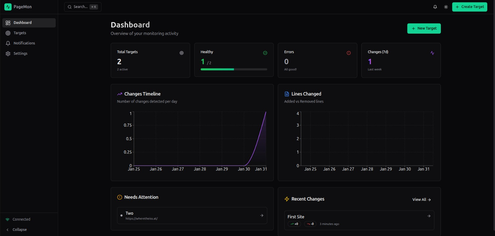
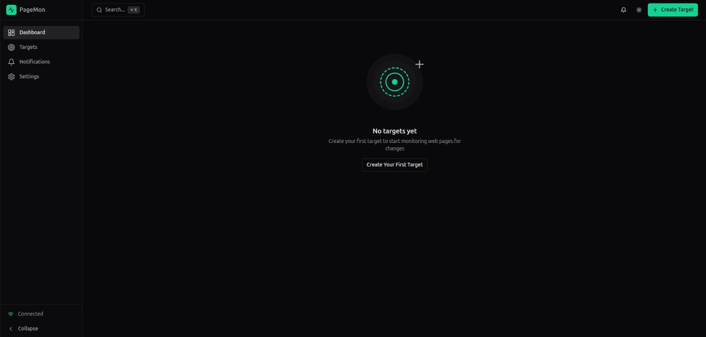

<div align="center">

# 🔍 Page Change Monitor

### Real-time Web Page Monitoring with Smart Diff Detection

[](https://spring.io/projects/spring-boot)
[](https://openjdk.org/)
[](https://react.dev/)
[](https://www.typescriptlang.org/)
[](https://www.postgresql.org/)
[](https://redis.io/)
[](LICENSE)

**Track changes, get notified, stay informed.**

[Features](#-features) • [Quick Start](#-quick-start) • [Architecture](#-architecture) • [Documentation](#-documentation) • [API Reference](#-api-reference)

</div>

---

## 📋 Table of Contents

- [Overview](#-overview)
- [Features](#-features)
- [Tech Stack](#-tech-stack)
- [Architecture](#-architecture)
- [Prerequisites](#-prerequisites)
- [Quick Start](#-quick-start)
- [Configuration](#-configuration)
- [Project Structure](#-project-structure)
- [API Reference](#-api-reference)
- [Monitoring & Observability](#-monitoring--observability)
- [Development](#-development)
- [Testing](#-testing)
- [Deployment](#-deployment)
- [Troubleshooting](#-troubleshooting)
- [Contributing](#-contributing)
- [License](#-license)

---

## 🌟 Overview

**Page Change Monitor** is a comprehensive, production-ready solution for monitoring and tracking changes on web pages. Whether you're monitoring competitor pricing, tracking documentation updates, or watching for content changes across multiple websites, this system provides real-time notifications and detailed change history with intelligent diff visualization.

### Why Page Change Monitor?

- **🎯 Precision Monitoring** - Track specific elements using CSS selectors or monitor entire pages
- **⚡ Smart Detection** - Ignore irrelevant changes with regex patterns and intelligent filtering
- **🔔 Instant Notifications** - Get notified immediately via Discord webhooks when changes occur
- **📊 Visual Diff** - Beautiful, unified diff viewer with syntax highlighting and search
- **🚀 High Performance** - Handle 50+ monitoring targets with optimized scheduling and caching
- **🔄 Dual Extraction Modes** - Static content (Jsoup) or JavaScript-rendered pages (Playwright)
- **📈 Analytics & Insights** - Dashboard with target health monitoring and change timeline
- **🛡️ Production-Ready** - Built with Spring Boot, React, PostgreSQL, and Redis for reliability

### Use Cases

✅ Monitor competitor websites for pricing or feature changes
✅ Track API documentation for breaking changes
✅ Watch for updates on blog posts or news articles
✅ Get notified about terms of service or privacy policy changes
✅ Monitor product availability on e-commerce sites
✅ Track government announcements or regulatory updates
✅ Watch for content changes on important resources

---

## ✨ Features

### Core Capabilities

#### 🎯 **Smart Monitoring**
- Create unlimited monitoring targets with custom intervals (minimum 1 minute)
- Choose between **TEXT** mode (fast, static content via Jsoup) or **PLAYWRIGHT** mode (JavaScript-rendered content)
- Use CSS selectors to monitor specific page elements
- Apply regex patterns to ignore irrelevant content changes
- Enable/disable targets without deletion
- Pause and resume monitoring on-demand

#### 🔍 **Advanced Change Detection**
- Intelligent content diffing using industry-standard algorithms
- Unified diff format with line-by-line comparison
- Visual diff viewer with:
  - Syntax highlighting for additions/deletions
  - Line numbering and statistics
  - Search with regex support and match navigation
  - Fullscreen mode for detailed inspection
  - Copy to clipboard and download diff files
  - Whitespace visualization toggle
  - Line wrapping options

#### 🔔 **Flexible Notifications**
- Discord webhook integration with customizable messages
- Test notifications before going live
- Secure webhook URL masking in UI
- Notification history and delivery tracking
- Future: Email, Slack, and custom webhook support

#### 📊 **Powerful Dashboard**
- Real-time overview of all monitored targets
- Status indicators (OK, ERROR, NEVER_RUN, DUE, RUNNING)
- Live countdown timers for next scheduled runs
- Recent changes timeline with quick access
- Target health monitoring and statistics
- Quick actions: Run now, edit, delete
- Responsive design for desktop, tablet, and mobile

#### ⚡ **Performance & Reliability**
- Distributed locking with Redis for multi-instance deployments
- Parallel execution with configurable thread pools
- Intelligent caching with Caffeine and Redis
- Circuit breakers and retry logic with Resilience4j
- Request timeout management (20s default, configurable)
- Batch processing for efficient scheduling
- Database connection pooling
- Actuator metrics and Prometheus integration

#### 🎨 **Modern User Experience**
- Dark/Light theme with system preference detection
- Command palette for quick navigation (Cmd/Ctrl + K)
- Toast notifications for user feedback
- Comprehensive error handling with recovery options
- Accessibility-first design (WCAG 2.1 compliant)
- Keyboard shortcuts throughout the app
- Responsive mobile experience

---

## 🛠 Tech Stack

### Backend Architecture

<table>
<tr>
<td width="50%">

**Core Framework**
- **Spring Boot 4.0.1** - Modern Java framework
- **Java 21** - Latest LTS with virtual threads
- **Spring Data JPA** - Database abstraction
- **Spring Web** - REST API development
- **Spring Validation** - Request validation

**Data & Persistence**
- **PostgreSQL 17** - Primary database
- **H2 Database** - In-memory testing
- **Flyway** - Database migrations
- **Redis 7** - Caching & distributed locks
- **Redisson** - Redis client library

</td>
<td width="50%">

**Content Extraction**
- **Jsoup 1.22.1** - HTML parsing & extraction
- **Playwright 1.57.0** - Browser automation
- **java-diff-utils 4.16** - Diff algorithm
- **Apache HttpClient 5** - HTTP requests

**Observability & Tools**
- **Spring Actuator** - Health checks & metrics
- **Micrometer Prometheus** - Metrics export
- **Logstash Logback** - Structured logging
- **SpringDoc OpenAPI 3.0.0** - API documentation
- **Resilience4j 2.2.0** - Circuit breakers
- **Caffeine** - In-memory caching

</td>
</tr>
</table>

### Frontend Architecture

<table>
<tr>
<td width="50%">

**Core Technologies**
- **React 18.3.1** - UI library with concurrent features
- **TypeScript 5.8.3** - Type-safe development
- **Vite 5.4.19** - Lightning-fast build tool
- **React Router 6.30.1** - Client-side routing

**State & Data**
- **TanStack Query 5.83.0** - Async state management
- **React Hook Form 7.61.1** - Form handling
- **Zod 3.25.76** - Schema validation
- **date-fns 3.6.0** - Date utilities

</td>
<td width="50%">

**UI & Styling**
- **Tailwind CSS 3.4.17** - Utility-first CSS
- **shadcn/ui** - Component library
- **Radix UI** - Accessible primitives
- **Framer Motion 12.29.0** - Animations
- **Lucide React 0.462.0** - Icon library
- **Sonner 1.7.4** - Toast notifications

**Development Tools**
- **Vitest 3.2.4** - Unit testing
- **Testing Library** - Component testing
- **ESLint 9.32.0** - Code quality
- **SWC** - Fast compilation

</td>
</tr>
</table>

### Infrastructure

- **Docker** - Containerization
- **Docker Compose** - Local development environment
- **Maven** - Build automation (backend)
- **npm** - Package management (frontend)

---

## 🏗 Architecture

### System Architecture

```
┌─────────────────────────────────────────────────────────────────┐
│                        Frontend (React + TS)                     │
│  ┌────────────┐  ┌────────────┐  ┌────────────┐  ┌───────────┐ │
│  │ Dashboard  │  │  Targets   │  │  Changes   │  │ Settings  │ │
│  └─────┬──────┘  └─────┬──────┘  └─────┬──────┘  └─────┬─────┘ │
│        │               │               │               │        │
│        └───────────────┴───────────────┴───────────────┘        │
│                        │                                         │
│                    TanStack Query                                │
│                        │                                         │
└────────────────────────┼─────────────────────────────────────────┘
                         │ REST API (JSON)
┌────────────────────────┼─────────────────────────────────────────┐
│                        ▼                                         │
│              Spring Boot REST API                                │
│  ┌──────────────┐  ┌──────────────┐  ┌──────────────┐          │
│  │   Target     │  │   Change     │  │ Notification │          │
│  │ Controller   │  │ Controller   │  │  Controller  │          │
│  └──────┬───────┘  └──────┬───────┘  └──────┬───────┘          │
│         │                 │                  │                  │
│  ┌──────▼─────────────────▼──────────────────▼───────┐          │
│  │         Domain Services & Business Logic          │          │
│  │  • TargetService  • ChangeDetector                │          │
│  │  • SchedulerService  • NotificationService        │          │
│  └───────────────────┬────────────────────────────────┘          │
│                      │                                           │
│  ┌───────────────────▼────────────────────────────────┐          │
│  │           Infrastructure Layer                     │          │
│  │  ┌──────────┐  ┌──────────┐  ┌──────────┐         │          │
│  │  │  Jsoup   │  │Playwright│  │  Redis   │         │          │
│  │  │ Fetcher  │  │ Fetcher  │  │  Lock    │         │          │
│  │  └──────────┘  └──────────┘  └──────────┘         │          │
│  └────────────────────────────────────────────────────┘          │
│                      │                                           │
└──────────────────────┼───────────────────────────────────────────┘
                       │
        ┌──────────────┴──────────────┐
        ▼                             ▼
   ┌────────┐                    ┌────────┐
   │  PostgreSQL │                │  Redis  │
   │  (Primary)  │                │ (Cache) │
   └─────────────┘                └─────────┘
```

### Data Flow

1. **Scheduling**: Background scheduler checks for targets due to run every 30 seconds
2. **Fetching**: Content is extracted using Jsoup (static) or Playwright (dynamic)
3. **Detection**: New content is compared against the last snapshot using diff algorithms
4. **Persistence**: Snapshots and changes are stored in PostgreSQL
5. **Notification**: Discord webhooks are triggered when changes are detected
6. **Caching**: Redis caches frequent queries and provides distributed locking
7. **UI Updates**: Frontend polls or refetches data using TanStack Query

### Component Diagram

```
┌─────────────────────────────────────────────────────────┐
│                    Backend Components                    │
├─────────────────────────────────────────────────────────┤
│                                                          │
│  ┌────────────────────────────────────────────────────┐ │
│  │           Scheduler (Fixed Delay: 30s)             │ │
│  └───────────────────┬────────────────────────────────┘ │
│                      │                                   │
│                      ▼                                   │
│  ┌───────────────────────────────────────────────────┐  │
│  │  Target Selection (DUE, ENABLED, Not Locked)      │  │
│  └───────────────────┬───────────────────────────────┘  │
│                      │                                   │
│         ┌────────────┴────────────┐                     │
│         ▼                         ▼                     │
│  ┌────────────┐          ┌─────────────┐               │
│  │   Jsoup    │          │ Playwright  │               │
│  │  Fetcher   │          │  Fetcher    │               │
│  │ (Static)   │          │ (Dynamic)   │               │
│  └─────┬──────┘          └──────┬──────┘               │
│        │                        │                       │
│        └────────────┬───────────┘                       │
│                     ▼                                   │
│        ┌─────────────────────────┐                     │
│        │   Content Processor     │                     │
│        │ • CSS Selector Filter   │                     │
│        │ • Regex Ignore Patterns │                     │
│        │ • Whitespace Normalize  │                     │
│        └───────────┬─────────────┘                     │
│                    ▼                                    │
│        ┌─────────────────────────┐                     │
│        │    Diff Calculator      │                     │
│        │ (java-diff-utils)       │                     │
│        └───────────┬─────────────┘                     │
│                    │                                    │
│        ┌───────────┴──────────┐                        │
│        ▼                      ▼                        │
│  ┌──────────┐          ┌────────────┐                 │
│  │   Save   │          │  Notify    │                 │
│  │ Snapshot │          │  Discord   │                 │
│  └──────────┘          └────────────┘                 │
│                                                         │
└─────────────────────────────────────────────────────────┘
```

---

## 📦 Prerequisites

### Required

- **Java 21** or higher ([Download OpenJDK](https://adoptium.net/))
- **Node.js 18+** and **npm 7+** ([Download](https://nodejs.org/))
- **Docker** and **Docker Compose** ([Download](https://www.docker.com/get-started))
- **Maven 3.9+** ([Download](https://maven.apache.org/download.cgi))

### Optional

- **Git** - For version control
- **PostgreSQL 17** - If not using Docker
- **Redis 7** - If not using Docker
- **IntelliJ IDEA** or **VS Code** - Recommended IDEs

### System Requirements

- **Memory**: 4GB RAM minimum (8GB recommended)
- **Storage**: 2GB free disk space
- **OS**: Linux, macOS, or Windows (with WSL2 for Docker)

---

## 🚀 Quick Start

### Option 1: Docker Compose (Recommended)

```bash
# 1. Clone the repository
git clone https://github.com/kaiquef30/page-mon
cd page-mon

# 2. Start infrastructure (PostgreSQL + Redis)
cd page-mon
docker-compose up -d

# 3. Wait for services to be healthy
docker-compose ps

# 4. Start the backend
mvn spring-boot:run -Dspring-boot.run.profiles=postgres

# 5. In a new terminal, start the frontend
cd ../page-change-monitor-front
npm install
npm run dev
```

**Access the application:**
- Frontend: http://localhost:8080
- Backend API: http://localhost:8080/api/v1
- Swagger UI: http://localhost:8080/swagger-ui
- Actuator: http://localhost:8080/actuator

### Option 2: Manual Setup

<details>
<summary><b>Expand for manual setup instructions</b></summary>

#### Backend Setup

```bash
# 1. Install and start PostgreSQL 17
# Follow your OS-specific instructions

# 2. Create database
psql -U postgres
CREATE DATABASE pagemon;
CREATE USER pagemon WITH PASSWORD 'pagemon';
GRANT ALL PRIVILEGES ON DATABASE pagemon TO pagemon;
\q

# 3. Install and start Redis 7
# Follow your OS-specific instructions

# 4. Build and run backend
cd backend
mvn clean install
mvn spring-boot:run -Dspring-boot.run.profiles=postgres
```

#### Frontend Setup

```bash
# 1. Install dependencies
cd frontend
npm install

# 2. Configure environment
cp .env .env.local
# Edit .env.local with your backend URL

# 3. Start development server
npm run dev
```

</details>

### First Steps

1. **Create your first monitoring target:**
   - Navigate to "Targets" → "New Target"
   - Enter a URL (e.g., `https://example.com`)
   - Set monitoring interval (e.g., 5 minutes)
   - Choose extraction mode (TEXT for static content)
   - Click "Create Target"

2. **Trigger a manual run:**
   - Click "Run Now" on your target
   - Wait a few seconds for the first snapshot

3. **Configure Discord notifications (optional):**
   - Go to Settings → Notifications
   - Add your Discord webhook URL
   - Test the notification
   - Enable notifications

4. **View the dashboard:**
   - Return to the Dashboard
   - See your target status and countdown timer
   - Wait for changes to be detected automatically

---

## ⚙️ Configuration

### Backend Configuration

The backend is configured via `application.yml`. Key settings:

<details>
<summary><b>Database Configuration</b></summary>

```yaml
spring:
  datasource:
    url: jdbc:postgresql://localhost:5432/pagemon
    username: pagemon
    password: pagemon
  jpa:
    hibernate:
      ddl-auto: validate
  flyway:
    enabled: true
```

Environment variables:
- `SPRING_DATASOURCE_URL`
- `SPRING_DATASOURCE_USERNAME`
- `SPRING_DATASOURCE_PASSWORD`

</details>

<details>
<summary><b>Redis Configuration</b></summary>

```yaml
spring:
  data:
    redis:
      host: localhost
      port: 6379
      password: ${REDIS_PASSWORD:}
      timeout: 2s
```

Environment variables:
- `REDIS_HOST`
- `REDIS_PORT`
- `REDIS_PASSWORD`

</details>

<details>
<summary><b>Monitoring Configuration</b></summary>

```yaml
monitor:
  scheduler:
    fixed-delay: PT30S      # How often to check for due targets
    batch-size: 50          # Max targets per batch

  fetch:
    timeout: PT20S          # HTTP request timeout
    user-agent: "page-change-monitor/1.0"

  lock:
    enabled: false          # Enable Redis distributed locks
    lease-time: PT3M        # Lock duration

  executor:
    core-pool-size: 4       # Thread pool core size
    max-pool-size: 10       # Thread pool max size
    queue-capacity: 50      # Queue capacity
```

Environment variables:
- `MONITOR_SCHEDULER_FIXED_DELAY`
- `MONITOR_LOCK_ENABLED`
- `MONITOR_EXECUTOR_CORE_POOL_SIZE`
- `MONITOR_EXECUTOR_MAX_POOL_SIZE`

</details>

### Frontend Configuration

Create a `.env.local` file:

```bash
# Backend API URL (no trailing slash)
VITE_API_BASE_URL=http://localhost:8080

# Optional: API prefix (default: /api/v1)
# VITE_API_PREFIX=/api/v1
```

### Discord Webhook Setup

1. **Create a Discord webhook:**
   - Go to your Discord server settings
   - Navigate to Integrations → Webhooks
   - Click "New Webhook"
   - Set a name and select a channel
   - Copy the webhook URL

2. **Configure in the app:**
   - Go to Settings → Notifications
   - Paste your webhook URL
   - Test the notification
   - Enable notifications

---

## 📁 Project Structure

```
page-change-monitor-project/
│
├── page-change-monitor/                 # Backend (Spring Boot)
│   ├── src/
│   │   ├── main/
│   │   │   ├── java/io/github/pagemon/
│   │   │   │   ├── domain/              # Domain models & services
│   │   │   │   │   ├── model/           # Target, Snapshot, Change
│   │   │   │   │   ├── port/            # Interfaces/adapters
│   │   │   │   │   └── service/         # Business logic
│   │   │   │   ├── application/         # REST API layer
│   │   │   │   │   ├── dto/             # Request/response DTOs
│   │   │   │   │   └── controller/      # REST controllers
│   │   │   │   └── infrastructure/      # Technical implementations
│   │   │   │       ├── persistence/     # JPA repositories
│   │   │   │       ├── fetch/           # Jsoup & Playwright
│   │   │   │       ├── scheduler/       # Background jobs
│   │   │   │       ├── notification/    # Discord integration
│   │   │   │       └── lock/            # Redis distributed locks
│   │   │   └── resources/
│   │   │       ├── application.yml      # Configuration
│   │   │       └── db/migration/        # Flyway migrations
│   │   └── test/                        # Unit & integration tests
│   ├── pom.xml                          # Maven dependencies
│   ├── docker-compose.yml               # PostgreSQL + Redis
│   └── Dockerfile                       # Backend container
│
└── page-change-monitor-front/           # Frontend (React + TS)
    ├── src/
    │   ├── components/                  # React components
    │   │   ├── ui/                      # shadcn/ui primitives
    │   │   ├── DiffViewer.tsx           # Diff visualization
    │   │   ├── StatusBadge.tsx          # Status indicators
    │   │   ├── Countdown.tsx            # Countdown timer
    │   │   ├── CommandPalette.tsx       # Cmd+K menu
    │   │   └── AppShell.tsx             # Layout wrapper
    │   ├── pages/                       # Route pages
    │   │   ├── Dashboard.tsx            # Main dashboard
    │   │   ├── TargetsList.tsx          # Targets listing
    │   │   ├── TargetDetail.tsx         # Target details
    │   │   ├── TargetForm.tsx           # Create/edit form
    │   │   ├── ChangeDetail.tsx         # Change diff view
    │   │   ├── Notifications.tsx        # Settings page
    │   │   └── NotFound.tsx             # 404 page
    │   ├── lib/api/                     # API client
    │   │   ├── client.ts                # HTTP client
    │   │   ├── queries.ts               # TanStack Query hooks
    │   │   └── types.ts                 # TypeScript types
    │   ├── contexts/                    # React contexts
    │   │   └── TimeContext.tsx          # Global time provider
    │   ├── hooks/                       # Custom hooks
    │   └── main.tsx                     # App entry point
    ├── package.json                     # npm dependencies
    ├── vite.config.ts                   # Vite configuration
    ├── tailwind.config.ts               # Tailwind CSS config
    └── tsconfig.json                    # TypeScript config
```

---

## 📡 API Reference

### Base URL

```
http://localhost:8080/api/v1
```

### Endpoints

#### Targets

<details>
<summary><code>GET /targets</code> - List all targets</summary>

**Query Parameters:**
- `enabled` (boolean, optional) - Filter by enabled status
- `status` (string, optional) - Filter by status: OK, ERROR, NEVER_RUN

**Response:**
```json
[
  {
    "id": "550e8400-e29b-41d4-a716-446655440000",
    "name": "Example Website",
    "url": "https://example.com",
    "enabled": true,
    "mode": "TEXT",
    "cssSelector": ".content",
    "ignoreRegexes": ["\\d{4}-\\d{2}-\\d{2}"],
    "intervalMinutes": 5,
    "nextRun": "2024-01-29T20:00:00Z",
    "lastRun": "2024-01-29T19:55:00Z",
    "lastStatus": "OK",
    "lastError": null,
    "createdAt": "2024-01-29T10:00:00Z",
    "updatedAt": "2024-01-29T19:55:00Z"
  }
]
```
</details>

<details>
<summary><code>POST /targets</code> - Create a new target</summary>

**Request Body:**
```json
{
  "name": "Example Website",
  "url": "https://example.com",
  "enabled": true,
  "mode": "TEXT",
  "cssSelector": ".content",
  "ignoreRegexes": ["\\d{4}-\\d{2}-\\d{2}"],
  "intervalMinutes": 5
}
```

**Validation:**
- `name`: 1-200 characters
- `url`: Valid HTTP/HTTPS URL
- `mode`: TEXT or PLAYWRIGHT
- `intervalMinutes`: >= 1
- `cssSelector`: Optional, valid CSS selector
- `ignoreRegexes`: Optional array of valid regex patterns

**Response:** 201 Created with target object
</details>

<details>
<summary><code>GET /targets/{id}</code> - Get target details</summary>

**Response:** Single target object
</details>

<details>
<summary><code>PATCH /targets/{id}</code> - Update target</summary>

**Request Body:** (all fields optional)
```json
{
  "name": "Updated Name",
  "enabled": false,
  "intervalMinutes": 10
}
```

**Response:** Updated target object
</details>

<details>
<summary><code>DELETE /targets/{id}</code> - Delete target</summary>

**Response:** 204 No Content
</details>

<details>
<summary><code>POST /targets/{id}/run</code> - Manually trigger target run</summary>

**Query Parameters:**
- `force` (boolean, default: false) - Force run even if not due

**Response:**
```json
{
  "targetId": "550e8400-e29b-41d4-a716-446655440000",
  "status": "SUCCESS",
  "changeDetected": true,
  "message": "Change detected",
  "executionTimeMs": 1234
}
```
</details>

#### Changes

<details>
<summary><code>GET /changes</code> - List all changes</summary>

**Query Parameters:**
- `targetId` (UUID, optional) - Filter by target
- `limit` (integer, optional) - Limit results (default: 50, max: 1000)

**Response:**
```json
[
  {
    "id": "660e8400-e29b-41d4-a716-446655440000",
    "targetId": "550e8400-e29b-41d4-a716-446655440000",
    "targetName": "Example Website",
    "detectedAt": "2024-01-29T19:55:00Z",
    "diff": "@@ -1,3 +1,3 @@\n line1\n-old content\n+new content\n line3",
    "addedLines": 1,
    "deletedLines": 1,
    "diffSizeBytes": 56
  }
]
```
</details>

<details>
<summary><code>GET /changes/{id}</code> - Get change details</summary>

**Response:** Single change object with full diff
</details>

<details>
<summary><code>GET /targets/{id}/changes</code> - Get changes for a specific target</summary>

**Query Parameters:**
- `limit` (integer, optional) - Limit results

**Response:** Array of change objects
</details>

#### Notifications

<details>
<summary><code>GET /notifications/discord</code> - Get Discord configuration</summary>

**Response:**
```json
{
  "id": "770e8400-e29b-41d4-a716-446655440000",
  "webhookUrl": "https://discord.com/api/webhooks/...",
  "enabled": true,
  "createdAt": "2024-01-29T10:00:00Z",
  "updatedAt": "2024-01-29T10:00:00Z"
}
```
</details>

<details>
<summary><code>PUT /notifications/discord</code> - Update Discord configuration</summary>

**Request Body:**
```json
{
  "webhookUrl": "https://discord.com/api/webhooks/...",
  "enabled": true
}
```

**Response:** Updated notification object
</details>

<details>
<summary><code>POST /notifications/discord/test</code> - Test Discord notification</summary>

**Response:**
```json
{
  "success": true,
  "message": "Test notification sent successfully"
}
```
</details>

#### Health & Monitoring

<details>
<summary><code>GET /actuator/health</code> - Health check</summary>

**Response:**
```json
{
  "status": "UP",
  "components": {
    "db": { "status": "UP" },
    "redis": { "status": "UP" },
    "diskSpace": { "status": "UP" }
  }
}
```
</details>

<details>
<summary><code>GET /actuator/prometheus</code> - Prometheus metrics</summary>

**Response:** Prometheus-formatted metrics
</details>

### OpenAPI Documentation

Interactive API documentation is available at:
- **Swagger UI**: http://localhost:8080/swagger-ui
- **OpenAPI JSON**: http://localhost:8080/v3/api-docs

---

## 📊 Monitoring & Observability

### Health Checks

```bash
# Basic health check
curl http://localhost:8080/actuator/health

# Detailed health (requires configuration)
curl http://localhost:8080/actuator/health/liveness
curl http://localhost:8080/actuator/health/readiness
```

### Metrics

Prometheus metrics are exposed at `/actuator/prometheus`:

**Key Metrics:**
- `http_server_requests_seconds` - HTTP request duration
- `jvm_memory_used_bytes` - JVM memory usage
- `jdbc_connections_active` - Database connections
- `cache_gets_total` - Cache hit/miss statistics
- `monitor_targets_total` - Total monitoring targets
- `monitor_checks_total` - Total monitoring runs
- `monitor_changes_detected_total` - Total changes detected

### Logging

Logs are structured in JSON format (Logback + Logstash encoder):

```json
{
  "timestamp": "2024-01-29T19:55:00.123Z",
  "level": "INFO",
  "logger": "io.github.pagemon.domain.service.TargetService",
  "message": "Change detected for target: Example Website",
  "target_id": "550e8400-e29b-41d4-a716-446655440000",
  "diff_size": 56
}
```

**Log Levels:**
- `ERROR` - Critical failures
- `WARN` - Recoverable issues (timeouts, retries)
- `INFO` - Business events (changes detected, notifications sent)
- `DEBUG` - Detailed execution flow
- `TRACE` - Low-level details (HTTP requests, SQL queries)

---

## 👨‍💻 Development

### Backend Development

```bash
cd page-mon

# Run with hot reload (spring-boot-devtools)
mvn spring-boot:run

# Run tests
mvn test

# Run integration tests
mvn verify

# Package for production
mvn clean package

# Run JAR
java -jar target/page-change-monitor-1.0.0.jar
```

**IDE Setup:**
- Import as Maven project
- Enable annotation processing
- Set Java SDK to 21
- Install Lombok plugin (if used)

### Frontend Development

```bash
cd frontend

# Install dependencies
npm install

# Start dev server with HMR
npm run dev

# Run linter
npm run lint

# Run tests
npm run test

# Run tests in watch mode
npm run test:watch

# Build for production
npm run build

# Preview production build
npm run preview
```

**VS Code Extensions:**
- ESLint
- Prettier
- Tailwind CSS IntelliSense
- TypeScript Vue Plugin (Volar)

### Database Migrations

Flyway migrations are in `src/main/resources/db/migration/`:

```
V1__initial_schema.sql
V2__add_notifications.sql
V3__add_indexes.sql
```

**Create a new migration:**
```bash
# Create file: V4__description.sql
# Follow naming convention: V{version}__{description}.sql
```

**Apply migrations:**
```bash
mvn flyway:migrate
```

**Rollback (manual):**
```bash
mvn flyway:clean  # ⚠️ Drops all data!
mvn flyway:migrate
```

---

## 🧪 Testing

### Backend Tests

```bash
cd backend

# Run all tests
mvn test

# Run specific test class
mvn test -Dtest=TargetServiceTest

# Run with coverage (requires jacoco plugin)
mvn test jacoco:report
```

**Test Categories:**
- Unit tests: `src/test/java/**/*Test.java`
- Integration tests: `src/test/java/**/*IT.java`
- Testcontainers for PostgreSQL integration

### Frontend Tests

```bash
cd frontend

# Run all tests
npm test

# Watch mode
npm run test:watch

# Coverage report
npm run test:coverage

# Interactive UI
npm run test:ui
```

**Test Files:**
- Component tests: `*.test.tsx`
- Unit tests: `*.test.ts`
- Coverage threshold: 60%

**Testing Technologies:**
- Vitest - Fast test runner
- Testing Library - User-centric component testing
- jsdom - Browser environment simulation

---

## 🚢 Deployment

### Docker Deployment

#### Backend

```bash
cd backend

# Build image
docker build -t page-change-monitor:latest .

# Run container
docker run -d \
  --name page-change-monitor \
  -p 8080:8080 \
  -e SPRING_PROFILES_ACTIVE=postgres \
  -e SPRING_DATASOURCE_URL=jdbc:postgresql://postgres:5432/pagemon \
  -e REDIS_HOST=redis \
  page-change-monitor:latest
```

#### Frontend

```bash
cd frontend

# Build production bundle
npm run build

# Serve with Nginx
docker run -d \
  --name page-monitor-frontend \
  -p 80:80 \
  -v $(pwd)/dist:/usr/share/nginx/html:ro \
  nginx:alpine
```

### Production Checklist

- [ ] Set strong database passwords
- [ ] Configure HTTPS/TLS
- [ ] Enable CORS for production domain only
- [ ] Set production logging levels (INFO/WARN)
- [ ] Configure Redis authentication
- [ ] Set up backup strategy for PostgreSQL
- [ ] Configure resource limits (CPU, memory)
- [ ] Set up monitoring and alerting
- [ ] Enable distributed locking for multi-instance
- [ ] Configure reverse proxy (Nginx, Traefik)
- [ ] Set up log aggregation (ELK, Loki)
- [ ] Configure rate limiting
- [ ] Review security headers
- [ ] Set up automated backups

### Environment Variables (Production)

```bash
# Backend
SPRING_PROFILES_ACTIVE=postgres
SPRING_DATASOURCE_URL=jdbc:postgresql://your-db:5432/pagemon
SPRING_DATASOURCE_USERNAME=pagemon
SPRING_DATASOURCE_PASSWORD=***SECURE_PASSWORD***
REDIS_HOST=your-redis
REDIS_PASSWORD=***SECURE_PASSWORD***
MONITOR_LOCK_ENABLED=true
MONITOR_EXECUTOR_CORE_POOL_SIZE=10

# Frontend
VITE_API_BASE_URL=https://your-api-domain.com
```

---

## 🔧 Troubleshooting

### Common Issues

<details>
<summary><b>Backend won't start - "Connection refused" to PostgreSQL</b></summary>

**Symptoms:**
```
Caused by: org.postgresql.util.PSQLException: Connection refused
```

**Solutions:**
1. Check PostgreSQL is running: `docker-compose ps`
2. Verify connection details in `application.yml`
3. Wait for PostgreSQL to be ready (check healthcheck)
4. Test connection: `psql -h localhost -U pagemon -d pagemon`
</details>

<details>
<summary><b>Frontend API calls fail with CORS errors</b></summary>

**Symptoms:**
```
Access to XMLHttpRequest blocked by CORS policy
```

**Solutions:**
1. Check backend CORS configuration in `application.yml`
2. Ensure frontend URL is in `allowed-origins`
3. Restart backend after CORS changes
4. Clear browser cache
</details>

<details>
<summary><b>Playwright fetcher fails - "Browser executable not found"</b></summary>

**Symptoms:**
```
Error: Executable doesn't exist at /path/to/chromium
```

**Solutions:**
1. Install Playwright browsers: `mvn exec:java -e -D exec.mainClass=com.microsoft.playwright.CLI -D exec.args="install"`
2. Or use Docker with Playwright pre-installed
3. Check Playwright version compatibility
</details>

<details>
<summary><b>Targets not running automatically</b></summary>

**Checklist:**
1. Is the target enabled? Check `enabled: true`
2. Is the interval valid? Check `intervalMinutes >= 1`
3. Is the scheduler running? Check logs for "Starting scheduler"
4. Is `nextRun` in the future? Check database
5. Are there errors? Check `lastError` field
</details>

<details>
<summary><b>High memory usage with many targets</b></summary>

**Solutions:**
1. Increase JVM heap: `-Xmx2g`
2. Reduce thread pool size: `MONITOR_EXECUTOR_MAX_POOL_SIZE=5`
3. Enable distributed caching with Redis
4. Reduce snapshot retention (manual cleanup)
5. Monitor with Prometheus metrics
</details>

### Debug Mode

**Backend:**
```bash
mvn spring-boot:run -Dspring-boot.run.arguments="--logging.level.io.github.pagemon=DEBUG"
```

**Frontend:**
```bash
# Open browser DevTools
# Check Console and Network tabs
# Look for API request/response details
```

### Getting Help

1. Check existing [GitHub Issues](https://github.com/YOUR_USERNAME/page-change-monitor/issues)
2. Review [API Documentation](#-api-reference)
3. Enable DEBUG logging and check logs
4. Check Actuator health endpoint
5. Open a new issue with:
   - Steps to reproduce
   - Expected vs actual behavior
   - Logs and error messages
   - Environment details (OS, Java version, etc.)

---

## 🤝 Contributing

We welcome contributions! Here's how you can help:

### Ways to Contribute

- 🐛 Report bugs and issues
- 💡 Suggest new features or improvements
- 📖 Improve documentation
- 🧪 Add tests and improve coverage
- 🔧 Fix bugs and implement features
- 🌐 Translate the UI (future)

### Development Workflow

1. **Fork the repository**
   ```bash
   git clone https://github.com/kaiquef30/page-mon
   cd page-mon
   ```

2. **Create a feature branch**
   ```bash
   git checkout -b feature/your-feature-name
   ```

3. **Make your changes**
   - Write clean, documented code
   - Add tests for new functionality
   - Follow existing code style
   - Update documentation if needed

4. **Test your changes**
   ```bash
   # Backend
   cd backend
   mvn test

   # Frontend
   cd front
   npm run lint
   npm test
   ```

5. **Commit with conventional commits**
   ```bash
   git commit -m "feat: add email notification support"
   git commit -m "fix: resolve CSS selector parsing issue"
   git commit -m "docs: update API reference"
   ```

6. **Push and create a Pull Request**
   ```bash
   git push origin feature/your-feature-name
   ```

### Code Style

**Backend (Java):**
- Follow [Google Java Style Guide](https://google.github.io/styleguide/javaguide.html)
- Use meaningful variable and method names
- Add Javadoc for public APIs
- Keep methods small and focused

**Frontend (TypeScript):**
- Use TypeScript strict mode
- Follow ESLint rules
- Use functional components and hooks
- Add JSDoc for complex functions

### Commit Message Convention

```
<type>(<scope>): <subject>

<body>

<footer>
```

**Types:**
- `feat`: New feature
- `fix`: Bug fix
- `docs`: Documentation only
- `style`: Code style (formatting, no logic change)
- `refactor`: Code refactoring
- `test`: Add or update tests
- `chore`: Build, tooling, dependencies

**Examples:**
```
feat(notifications): add Slack webhook support
fix(diff): handle null content gracefully
docs(api): add examples for target creation
test(frontend): add DiffViewer component tests
```

---

## 📄 License

This project is licensed under the **MIT License** - see the [LICENSE](LICENSE) file for details.

```
MIT License

Copyright (c) 2024 Page Change Monitor

Permission is hereby granted, free of charge, to any person obtaining a copy
of this software and associated documentation files (the "Software"), to deal
in the Software without restriction, including without limitation the rights
to use, copy, modify, merge, publish, distribute, sublicense, and/or sell
copies of the Software, and to permit persons to whom the Software is
furnished to do so, subject to the following conditions:

The above copyright notice and this permission notice shall be included in all
copies or substantial portions of the Software.

THE SOFTWARE IS PROVIDED "AS IS", WITHOUT WARRANTY OF ANY KIND, EXPRESS OR
IMPLIED, INCLUDING BUT NOT LIMITED TO THE WARRANTIES OF MERCHANTABILITY,
FITNESS FOR A PARTICULAR PURPOSE AND NONINFRINGEMENT. IN NO EVENT SHALL THE
AUTHORS OR COPYRIGHT HOLDERS BE LIABLE FOR ANY CLAIM, DAMAGES OR OTHER
LIABILITY, WHETHER IN AN ACTION OF CONTRACT, TORT OR OTHERWISE, ARISING FROM,
OUT OF OR IN CONNECTION WITH THE SOFTWARE OR THE USE OR OTHER DEALINGS IN THE
SOFTWARE.
```

---

## 🌟 Acknowledgments

This project is built with amazing open-source technologies:

**Backend:**
- [Spring Boot](https://spring.io/projects/spring-boot) - Application framework
- [Jsoup](https://jsoup.org/) - HTML parsing
- [Playwright](https://playwright.dev/) - Browser automation
- [PostgreSQL](https://www.postgresql.org/) - Database
- [Redis](https://redis.io/) - Caching and locking
- [Flyway](https://flywaydb.org/) - Database migrations

**Frontend:**
- [React](https://react.dev/) - UI library
- [TypeScript](https://www.typescriptlang.org/) - Type safety
- [Vite](https://vitejs.dev/) - Build tool
- [TanStack Query](https://tanstack.com/query) - Data fetching
- [shadcn/ui](https://ui.shadcn.com/) - Component library
- [Tailwind CSS](https://tailwindcss.com/) - Styling
- [Radix UI](https://www.radix-ui.com/) - Accessible primitives
- [Framer Motion](https://www.framer.com/motion/) - Animations

---

## 📸 Screenshots

### Dashboard Overview

<div align="center">
  
  <p><i>The main dashboard showing monitoring targets, status indicators, and recent changes</i></p>
</div>

### Interface

<div align="center">
  
  <p><i>Application interface with monitoring details</i></p>
</div>

---

<div align="center">

### 🚀 Ready to start monitoring?

**[Quick Start](#-quick-start)** • **[Configuration](#-configuration)** • **[API Docs](#-api-reference)**

---

**Built with ❤️ and Java + React**

⭐ Star this project if you find it useful!

</div>
